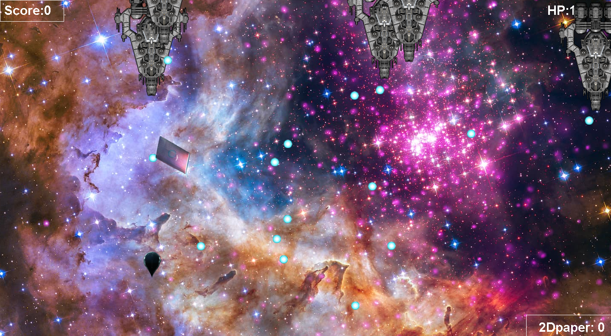
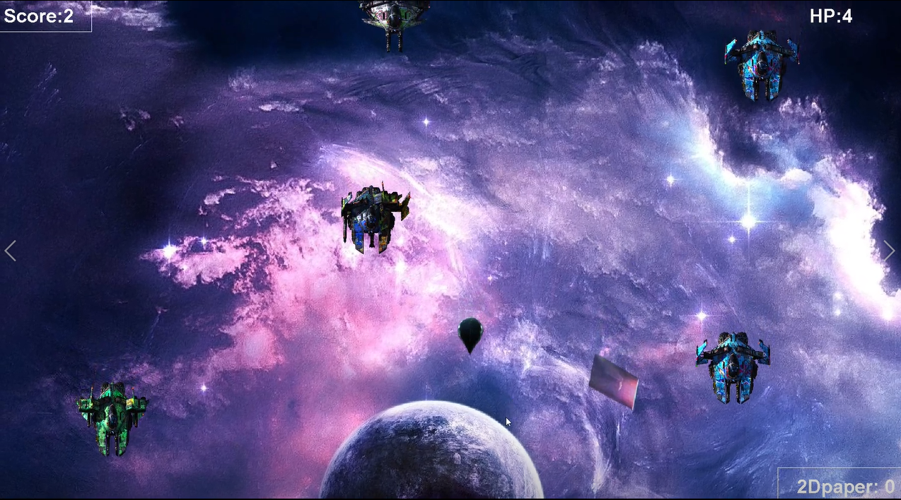

# The WaterDrop

**The WaterDrop** is a 2D space game based on The Three-Body Problem, which is the famous sci-fi novel wrote by CiXinLiu.

In this game, you would drive the waterdrop created by the three-body creatures. The waterdrop is made of special meterials which enables you
to destory the enemies (spaceships made by human) by direct collision.

The game goes like this:

You can see the drop-like stuff, which is controlled by the player. Above the waterdrop, a card-like stuff is so-called "two-dimensional card", which would be possesed by you once touched by your waterdrop. 

In the game, there are three type of things you should know:

## WaterDrop

Waterdrop is the special weapon created by three-body creatures. It's made of special meterials of the highest rigidity, which would never destoryed by anything. 

You control it with your arrow keys. When an arrow key is being pressed, the waterdrop would gain an acceleration towards the direction you specifiy with your arrow key.

Press `R` to shoot your bullet.

You can destroy enemies either by direct collision or bullet shooting.

## 2D paper

2D paper is the ultimate weapon created by some creatures with really advanced techs. It twists the spaces and reduce the dimensions from three
to two. 

All things except the waterdrop would be destoryed by the 2D-paper. 

Press `T` to use your 2D paper.

Touch the 2D paper to get one.

## Enemies

Enemies are made of human spaceships.

In the level-1, they would shoot various kinds of bombs towards you. Once hit by the bomb, the `HP` would decrease by one.

In the level-2, you are not allowed to shoot any bullet or bomb. The spaceships are trying to escape from you screen, so you must destroy them in the screen. Once a spaceship escaped from screen, the `HP` would decrease by one. 

>The game is still under construction, waiting for your issues and pull requests.
 
>Feel free to clone the repo!
